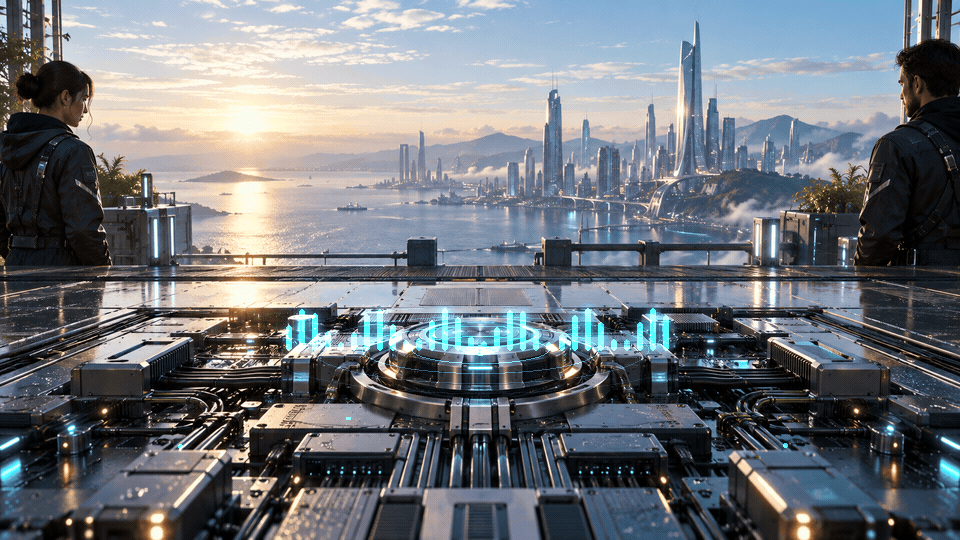

# ⚡ Motivational Momentum 365

[](https://chevcellios.github.io/motivational-momentum-365/)


One idea. One creation. Keep moving. Motivational Momentum 365 brings together AI-assisted artwork, code and daily creative experiments.

## 🔗 Watch the collection

| Creation | Page | GIF |
| --- | --- | --- |
| 005 — Resonance | [Watch](https://chevcellios.github.io/motivational-momentum-365/) | [GIF](resonance.gif) |
| 004 — Beyond the Horizon | [Watch](https://chevcellios.github.io/motivational-momentum-365/horizon.html) | [GIF](horizon.gif) |
| 003 — Emergence | [Watch](https://chevcellios.github.io/motivational-momentum-365/emergence.html) | [GIF](emergence.gif) |
| 002 — Teleportation | [Watch](https://chevcellios.github.io/motivational-momentum-365/teleportation.html) | [GIF](teleportation.gif) |
| 001 — Perpetuum | [Watch](https://chevcellios.github.io/motivational-momentum-365/perpetuum.html) | [GIF](perpetuum.gif) |

## 📡 Latest creation — Resonance

> Find your rhythm. Build your future.

A small device wakes above a circuit board. Concentric light waves travel across the desk, while a pulse of energy turns isolated signals into a shared rhythm. Every loop returns to the same source: consistency creates momentum.

The dawn city, workbench and human figures are AI-assisted artwork. The expanding waves, equalizer pulse, energy paths and RGB indicators are animated through code.

## ✨ Features

- bright cyberpunk city at dawn
- rhythmic concentric light waves
- animated device core and circuit-board energy paths
- RGB status lights and pulse bars
- eight seconds, 160 frames and continuous looping
- responsive pages with pause controls
- all previous creations preserved

GitHub may pause GIFs according to the viewer's accessibility settings. The standalone pages start automatically and provide pause controls.

## 🎨 Creative process

The background illustration was generated with AI assistance. The final animation is rendered locally with Python and open-source tools. Image-generation prompts and private working notes are not included.

## ⚙️ Technologies

- Python and Pillow — frame rendering and compositing
- FFmpeg — GIF palette optimization and export
- HTML, CSS and JavaScript — standalone viewing pages
- GitHub Markdown and GitHub Pages — presentation and hosting

## 🚀 Run locally

Open `index.html` in a browser. To rebuild Resonance, install the dependencies and ensure FFmpeg is available on PATH:

```sh
python -m pip install -r requirements.txt
python src/render_resonance.py
```

The script reads `assets/resonance/base.png`, writes `resonance.gif` and saves a poster to `assets/resonance/poster.jpg`.

## 📁 Project structure

```text
motivational-momentum-365/
├── README.md
├── index.html
├── horizon.html
├── emergence.html
├── teleportation.html
├── perpetuum.html
├── resonance.gif
├── horizon.gif
├── emergence.gif
├── teleportation.gif
├── perpetuum.gif
├── assets/
│   ├── resonance/
│   ├── horizon/
│   ├── emergence/
│   └── teleportation/
└── src/
    ├── render_resonance.py
    ├── render_horizon.py
    ├── render_emergence.py
    ├── render_teleportation.py
    └── render.py
```

## 🤝 Feedback

Ideas and bug reports are welcome through [GitHub Issues](https://github.com/ChevCellios/motivational-momentum-365/issues).

## 📬 Contact

- GitHub: [ChevCellios](https://github.com/ChevCellios)
- Project: [Motivational Momentum 365](https://github.com/ChevCellios/motivational-momentum-365)
