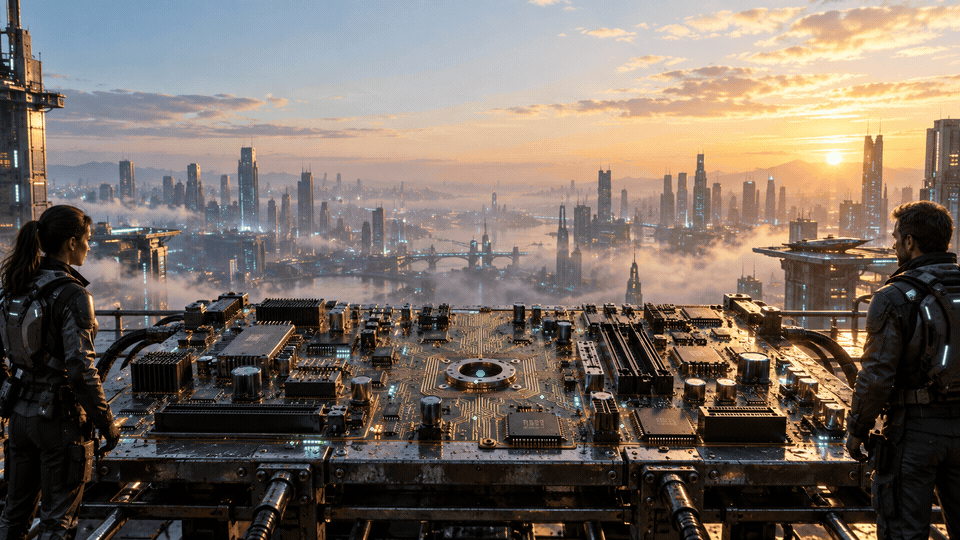
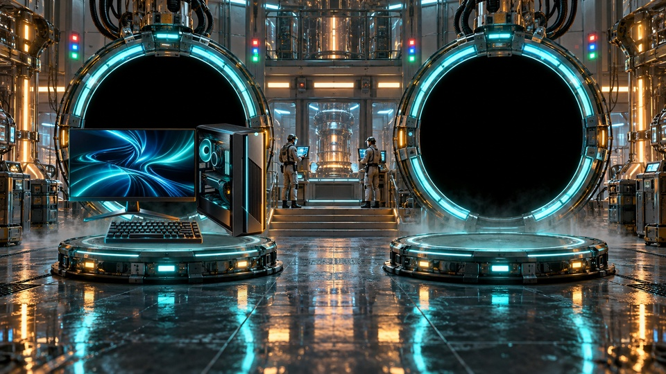
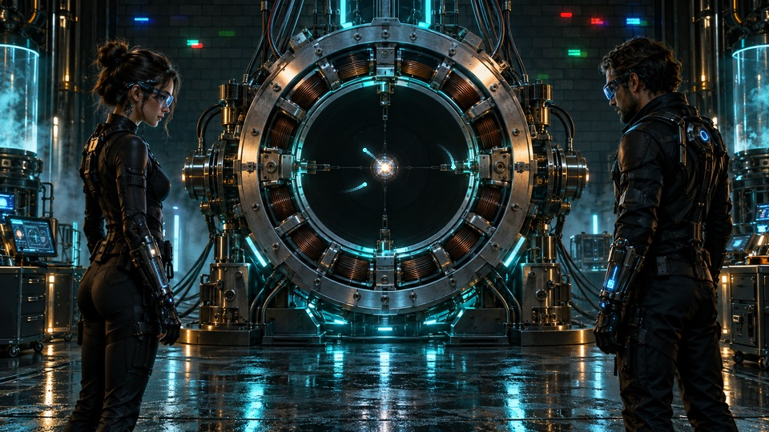

# ⚡ Motivational Momentum 365

[](https://chevcellios.github.io/motivational-momentum-365/)


Motivational Momentum 365 is a collection of motivational visual experiments combining artificial intelligence, programming and creative expression. One idea. One creation. Keep moving.

## 🔗 Explore the collection

- [003 — Emergence](https://chevcellios.github.io/motivational-momentum-365/)
- [002 — Teleportation](https://chevcellios.github.io/motivational-momentum-365/teleportation.html)
- [001 — Perpetuum](https://chevcellios.github.io/motivational-momentum-365/perpetuum.html)
- [Latest GIF](emergence.gif) · [Animation source code](src/render_emergence.py)

The latest GIF appears directly below the repository title. Autoplay on GitHub depends on each viewer's motion preferences. The standalone pages start immediately and include pause controls.

## 🌱 Latest creation — Emergence

> Small beginnings. Extraordinary futures.

At sunrise above a futuristic city, a small light awakens inside an old motherboard. Copper branches rise from its circuits and unfold into a crown of emerald crystal leaves. The tree glimmers, returns to a luminous seed and begins again.

Emergence is a visual metaphor for growth: something new can begin with the tools and ideas already in front of us.

## ✨ Features

- a bright rooftop setting with a detailed motherboard and two researchers
- a copper tree with translucent emerald leaves
- procedural growth, anchored motion and gradual crown reveal
- electrical impulses moving toward the tree's base
- leaf glints, subtle sway and a particle-based renewal phase
- a ten-second continuous loop at 20 frames per second
- English descriptions and responsive pages
- previous creations preserved in the collection

The researchers and city remain still. Growth, energy traces, glints, shadows and renewal are animated through code using layered artwork.

## 🎨 How it is made

1. AI tools create the rooftop illustration and a separate tree with a transparent background.
2. Python anchors the tree to the motherboard and calculates growth masks and transformations.
3. Pillow and NumPy composite the tree, shadows and light effects for each frame.
4. FFmpeg exports an optimized GIF when available; Pillow provides a fallback.
5. GitHub Markdown displays the animation, and a standalone page provides playback controls.

## 🗂️ Previous creations

### 002 — Teleportation

[](https://chevcellios.github.io/motivational-momentum-365/teleportation.html)

> Your next breakthrough is closer than you think.

A computer dissolves into light and reappears on another platform. [Open the eight-second GIF](teleportation.gif).

### 001 — Perpetuum

[](https://chevcellios.github.io/motivational-momentum-365/perpetuum.html)

> Every ending sets a new beginning in motion.

A rotating machine, a closed energy path and glowing RGB bricks. [Open the six-second GIF](perpetuum.gif).

## 🔒 Creative process

Finished artwork, source assets and animation code are included. Image-generation prompts and private working notes are not shared.

## ⚙️ Technologies

- Python, Pillow and NumPy — procedural animation and compositing
- FFmpeg — optional GIF optimization
- HTML, CSS and JavaScript — standalone pages
- GitHub Markdown and GitHub Pages — presentation and hosting

The animation tools are free and open source. Rebuilding the animations from the included assets requires no paid service or API key. The source illustrations were previously created using an AI tool.

## 🚀 Run locally

Open `index.html` in a browser to watch Emergence. The previous creations have their own pages: `teleportation.html` and `perpetuum.html`.

To rebuild Emergence, use Python with the pinned dependencies:

```sh
python -m pip install -r requirements.txt
python src/render_emergence.py
```

To rebuild the earlier creations:

```sh
python src/render_teleportation.py
python src/render.py
```

FFmpeg is detected automatically when available on your system PATH. Without it, Pillow exports the GIF; the file may be larger.

## 📁 Project structure

```text
motivational-momentum-365/
├── README.md
├── index.html
├── teleportation.html
├── perpetuum.html
├── emergence.gif
├── teleportation.gif
├── perpetuum.gif
├── requirements.txt
├── assets/
│   ├── scene.png
│   ├── poster.jpg
│   ├── teleportation/
│   └── emergence/
│       ├── rooftop.png
│       ├── tree.png
│       └── poster.jpg
└── src/
    ├── render.py
    ├── render_teleportation.py
    └── render_emergence.py
```

## 🤝 Feedback

Suggestions and bug reports are welcome through [GitHub Issues](https://github.com/ChevCellios/motivational-momentum-365/issues).

## 📬 Contact

- GitHub: [ChevCellios](https://github.com/ChevCellios)
- Project: [Motivational Momentum 365](https://github.com/ChevCellios/motivational-momentum-365)
